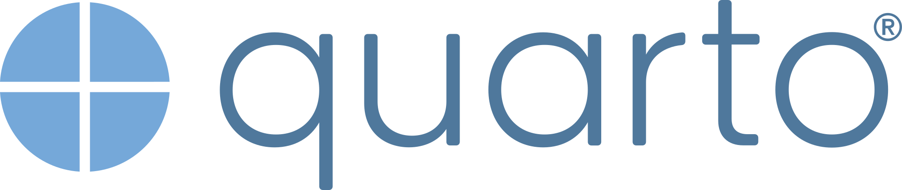
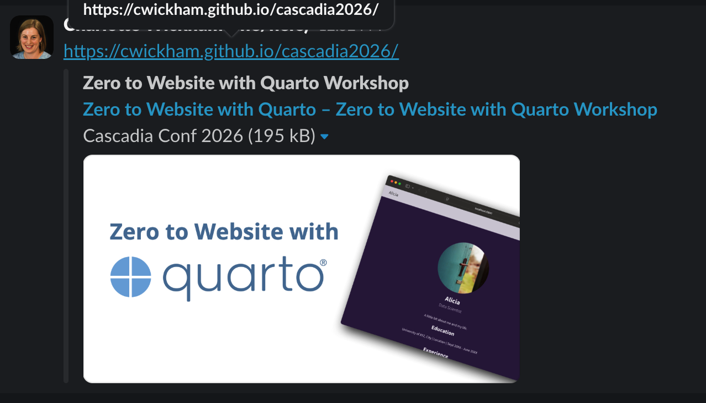

## From Zero to Website with Quarto {#setup}

::: {.columns}
::: {.column width="60%"}
1. Find the Slack channel `#workshop-quarto-2026` in the [main conference Slack](https://join.slack.com/t/cascadiarconf/shared_invite/zt-1lu53059t-GAxQtzrwQhmo7BXE7YfC8w)

2. Check you've completed the steps on the  [Pre-work page](https://cwickham.github.io/cascadia2026/prework.html).
::: 

::: {.column width="40%"}
Workshop website

:::
:::

::: footer
Workshop website: <https://cwickham.github.io/cascadia2026>
:::

## Hello, I'm Charlotte Wickham

:::: {.columns}
::: {.column width="60%"}

Developer Advocate  
{height="1em" style="vertical-align: middle;" fig-alt="Quarto"} @ {height="1em" style="vertical-align: middle;" fig-alt="Posit"}  

Based in Corvallis, OR
<br>

 [cvwickham](https://www.linkedin.com/in/cvwickham/)  
 [cwickham](https://github.com/cwickham)  
 [charlotte.wickham@posit.co](mailto:charlotte.wickham@posit.co)  
:::
::: {.column width="40%"}
Workshop website

:::
::::

::: footer
<https://cwickham.github.io/cascadia2026>
:::

## Your Turn

::: task
Introduce yourself to your neighbors:

-   Name
-   Location
-   What you need a website for

Check you are all [set up](#setup)
:::



::: footer
<https://cwickham.github.io/cascadia2026>
:::

## Outline

Goal: You create a website with Quarto

1.  Don't start from scratch
3.  Add pages and customize navigation
4.  Make the style your own
5.  Publish
6.  Use listings for "lists" of content

BREAK: 3:00 -- 3:15pm

::: footer
<https://cwickham.github.io/cascadia2026>
:::

## What to expect

**My turns:** I'll use slides, and live code to demonstrate ideas.

**Your Turns:** You practice what you've just seen.

Ask questions:

* During Your Turns
* After Your Turns
* In Slack channel

::: footer
<https://cwickham.github.io/cascadia2026>
:::

# 1. Don't start from scratch

## Demo: Start from a template

From a new empty project:

``` {.bash filename="Terminal"}
quarto use template cwickham/website-starter
```

## Your Turn: Get the starter template

::: task
1. Start a new project.   
    RStudio > New Project  
    Positron > New Folder from Template > Empty Project
2. Get the template: 

    ``` {.bash filename="Terminal"}
    quarto use template cwickham/website-starter
    ```

    *Create a subdirectory for template? No*

3. Open and preview `index.qmd`.

4. Match the content in `index.qmd` to the preview.
:::



## Demo: Exploring `index.qmd` {.smaller}

* Render/preview `index.qmd`. It becomes `index.html`, your homepage.

* Regular Quarto document with:
   
   - YAML Header
   - Content, possibly including code cells

* Workflow: Edit, render/preview

* Uses an `about` template: <https://quarto.org/docs/websites/website-about.html>

* Other templates: `jolla`, `trestles`, `solana`, `marquee`, or `broadside`

## Your Turn

::: {.task}

Edit `index.qmd`: 

*  Change the `title` and `subtitle`
*  Try a different template: `jolla`, `trestles`, `solana`, `marquee`, or `broadside`
*  Edit, add, or remove items in `links`. Find other `icon`s at <https://icons.getbootstrap.com/>
*  **Challenge**: Use a different `image`, and edit `image-alt`

Spare time? Edit the *content* of the page

:::



## Demo: Use a different `image`

1. Move new image into project
2. Replace path
3. Edit `image-alt`

Paths in a `.qmd` are relative to the location of the `.qmd`

## What is a Quarto website?

A minimal website only needs two files:

::::: columns

:::{.column}
```{.yaml filename="_quarto.yml"}
project: 
  type: website
```    
Tells Quarto this is a website project
:::

:::{.column}
```{.markdown filename="index.qmd"}
---
title: My homepage
---
```
Becomes `index.html` the homepage
:::

:::::

## What else is in this template?

```default
website/
├── _quarto.yml   
├── index.qmd      
├── profile.jpg   # Used in `index.qmd` 
├── _brand.yml    # Theming
├── styles.scss   # Custom styles, none defined`
├── _examples/    # For teaching, not in website
├── README.md     # For GitHub, not in website
└── _site/        # Fully rendered site, .gitignored
```

# 2. Add pages and customize navigation

## Demo: Add a page

1.  New Quarto Document: `projects.qmd` 

    ```{.markdown shortcodes="false" filename="projects.qmd"}
    ---
    title: Projects
    ---

    Some projects I've worked on:

    ```

2.  File path becomes URL path: `{ site url }/projects.html`

## Demo: Add navigation

`_quarto.yml`: configuration file

``` {.yaml filename="_quarto.yml"}
website:
  navbar:
    right: 
      - projects.qmd
```

## Folder structure determines URLs {.smaller}

```default
website/  
├── _quarto.yml
├── index.qmd             { base url }
├── about.qmd             { base url }/about.html  
├── reports/                       
|    ├── index.qmd        { base url }/reports/   
|    └── last-month.qmd   { base url }/reports/last-month.html 
└── data/                 
    └── sales.csv         { base url }/data/sales.csv
```

`{ base url }`: `http://localhost:XXXX` when previewing locally

## Your Turn 

::: {.task}

1. Add a page
2. Add a link to the page in the navigation
3. Skim <https://quarto.org/docs/websites/website-navigation.html>. **What other types of navigation are available?**

*Spare time*: Add content to the page

:::



## Demo: Navigation

1. Put items on `left`
1. Switch to a `sidebar` with `content` and back again
2. Edit `tools`

Quick reference: <https://quarto-tdg.org/websites.html#other-navigation-elements>

# 3.  Make the style your own

## Use brand.yml: Color

``` {.yaml filename="_brand.yml"}
color:
  foreground: "#333333"  # font color
  background: "#ffffff"  # background color
  primary: "#333333"     # navbar and links
```

**Demo:** Change `primary` 

**Positron command:** Show or Focus Standalone Color Picker

Brand Guide: <https://quarto.org/docs/authoring/brand.html>

## Use brand.yml: Fonts

``` {.yaml filename="_brand.yml"}
typography:
  fonts:
    - family: Open Sans
      source: bunny
    - family: Roboto Slab
      source: bunny
  base:
    family: Open Sans
  headings:
    family: Roboto Slab
```

**Demo:** Add these to `_brand.yml`

`bunny`: Bunny Fonts, zero-tracking and no-logging policy <https://fonts.bunny.net>

## Demo: Check accessibility with `axe`

Once you start playing with colors it's easy to create contrast issues. 

Check with [`axe-core`](https://github.com/dequelabs/axe-core) by adding:

```{.yaml filename="_quarto.yml"}
format:
  html:
    axe:
      output: document
```

Remove before publishing! 

## Your Turn

::: task

1. Edit `_brand.yml` to customize colors and fonts

2. Enable the `axe` checks to check for contrast issues

:::

Brand Guide: <https://quarto.org/docs/authoring/brand.html#brand-elements>



## Use brand.yml: Code

If your pages have code, you will probably want to tweak `monospace` options:

``` {.yaml filename="_brand.yml"}
typography:
  monospace-inline:
    color: "#6b21a8"
    background-color: background 
  monospace-block:
    background-color: "#eaf2fb"
```

## Use brand.yml: Dark mode

Add `light` and `dark` to colors to add a dark mode toggle to your site:

``` {.yaml filename="_brand.yml"}
color:
  foreground: 
    light: "#333333"
    dark: "#ffffff"
  background: 
    light: "#ffffff"
    dark: "#333333"
  primary: 
    light: "#333333"
    dark: "#ffffff"
```

## Name colors under `color: palette` to more easily refer to them

```{.yaml filename="_brand.yml"}
color:
  palette:
    white: "#ffffff"
    grey: "#333333"
    pink: "#b70ca6"
  foreground: grey
  background: white
  primary: grey
```

## Sometimes you might need to add SCSS  {.smaller}

:::::: columns
Apply `styles.scss` to all pages:

::: column
``` {.yaml filename="_quarto.yml"}
format:
  html:
    theme: [styles.scss, brand]
```
:::

:::: column

::: fragment
``` {.scss filename="styles.scss"}
/*-- scss:defaults --*/
// Set SASS variables: https://quarto.org/docs/output-formats/html-themes.html#sass-variables
$navbar-fg: $brand-white;

/*-- scss:rules --*/
// CSS rules 
.navbar-title {
  color: lighten($brand-pink, 50%);
}

h1 {
  color: $brand-pink;
}
```
:::
::::
::::::

See `_examples/brand-scss`.

## Aside: The three parts of `_quarto.yml`

```{.yaml filename="_quarto.yml" code-line-numbers="1-2|4-16|18-20"}
project: # Project options 
  type: website

website: # Website options 
  title: "My Website"
  search: false
  open-graph: true # https://quarto.org/docs/websites/website-tools.html#open-graph
  page-footer: "Made with ❤️ and Quarto"
  navbar:
    right:
      - text: Home
        href: index.qmd
    tools: 
      - icon: github
        text: Github
        href: https://github.com

format: # Page 'html' format options
  html:
    theme: [brand, styles.scss]    
```

Reference: [Projects > Websites](https://quarto.org/docs/reference/projects/websites.html), and [Formats > HTML](https://quarto.org/docs/reference/formats/html.html)

# 4. Publish

## Demo: Use `quarto publish`

``` {.bash filename="Terminal"}
quarto publish posit-connect-cloud
```

Other venues: `gh-pages`, `netlify`, `connect`

Updates? Re-run `quarto publish`

Pick **one of**: 

* Your Turn: Posit Connect Cloud
* Your Turn: GitHub Pages


::: footer
<https://quarto.org/docs/publishing/>
:::

## Your Turn: Posit Connect Cloud

::: task

1.  Publish your site to Posit Connect Cloud:
    
    ``` {.bash filename="Terminal"}
    quarto publish posit-connect-cloud
    ```

2.  **Challenge**: find the setting to customize the URL. 
:::



## Your Turn: GitHub Pages

::: task

1.  Make your project a Git repo. 
    
2.  Commit, and push to GitHub

3.  Publish to GitHub Pages:

    ``` {.bash filename="Terminal"}
    quarto publish gh-pages
    ```

:::



## Which venue is right for you?

| Provider             | Private Source | Private Site                 | Custom Domain |
|----------------------|----------------|------------------------------|---------------|
| Posit Connect Cloud  | ✔️             | Paid plans                   | Paid plans    |
| GitHub               | Paid plans     | GitHub Enterprise Cloud only | ✔️            |
| Netlify              | ✔️             | Paid plans                   | ✔️            |

Or Posit Connect if your org has it.

## Other publishing workflows

1. Posit Connect Cloud: 
    
    - Use [Posit Publisher extension](https://marketplace.visualstudio.com/items?itemName=Posit.publisher) in Positron or VS Code
    - Connect [directly to GitHub repo](https://docs.posit.co/connect-cloud/user/publish/github.html)

2. Continuous integration: <https://quarto-tdg.org/websites.html#sec-ci>

## Website metadata: search engines

Set `title`, `description` and `site-url`.

E.g. for this workshop's website:

```{.yaml filename="_quarto.yml"}
website:
  title: Zero to Website with Quarto
  description: "Zero to website with Quarto Workshop for Cascadia R Conf 2026"
  site-url: https://cwickham.github.io/cascadia2026
```

## Website metadata: social cards

Add a 1200 × 630 px `image` and `image-alt`:

::: {.columns}
::: {.column}
```{.yaml filename="_quarto.yml"}
website:
  image: thumbnail.jpeg
  image-alt: "Zero to Website with Quarto with a screenshot of a website titled 'Alicia, Data Scientist'."
  open-graph: true 
```
:::

::: {.column}
{fig-alt="Example of social card for the workshop website as seen in Slack"}
:::

:::

# 5. Use listings for lists of content

## A listing is...

-   an automatically generated list of content
-   styled via a template, (built-in `type`, or custom `template`)
-   can be included on any page

::: footer
<https://quarto.org/docs/websites/website-listings.html>
:::

## Use listings for ...

::: {.panel-tabset}

## Blog


## People


## Publications


:::

See more examples at: <https://charlotte.quarto.pub/listings/>

## Listing contents: can be a YAML file {.smaller}

Items link to `path`.

``` {.yaml filename="_examples/listing-talks/talks.yml"}
- date: 2025-03-12
  title: "From Notebook to Production: Deploying ML Models with Confidence"
  description: "A practical walkthrough of taking a model out of a Jupyter notebook and into a reproducible, monitored production pipeline—covering containers, CI/CD, and drift detection."
  venue: "PyData Seattle"
  path: "https://example.com/talks/notebook-to-production"

- date: 2024-11-08
  title: "The Art of the Reproducible Report"
  description: "Why your analysis should run end-to-end with a single command, and how literate programming tools like Quarto make stakeholder-ready reports painless."
  venue: "posit::conf"
  path: "https://example.com/talks/reproducible-report"

- date: 2024-06-04
  title: "Causal Inference for the Skeptical Analyst"
  description: "Correlation isn't causation, but we can do better than throwing up our hands. An accessible tour of difference-in-differences, propensity scores, and when to trust them."
  venue: "useR! Conference"
  path: "https://example.com/talks/causal-inference-skeptical-analyst"
```


## Listing contents: can other pages {.smaller}

Items link to page.


::: {.columns}

::: {.column}
```default
_examples/listing-projects
└──projects
    ├── coastal-sensors.qmd
    ├── forest-canopy.qmd
    ├── watershed-forecasting.qmd
    └── images
```
:::

::: {.column}

````{.markdown .code-overflow-wrap filename="projects/coastal-sensors.qmd"}
---
title: "Coastal Sensor Network"
description: "Real-time monitoring of water quality along the Oregon coast using a fleet of low-cost IoT sensors."
image: images/photo-1601698832159-665cbefd11da.jpg
categories: [IoT, Time Series, Dashboards]
---

## Overview

Placeholder content. This project deploys a network of sensors that stream
temperature, salinity, and turbidity readings into a central pipeline, surfaced
through a live dashboard for researchers and the public.

Photo by [Karsten Winegeart](https://unsplash.com/@_karsten) on [Unsplash](https://unsplash.com/photos/_m-Xjo9R_y4).

````
:::

:::

## Your turn: Brainstorm a listing

::: task

1. Brainstorm a list of content you might want to include in your website.

2. What are the key pieces of information for each item? E.g. `title`, `description`, ... etc.

3. Does it make sense to give items each their own page, or to use a YAML file?

:::

See more examples at: <https://charlotte.quarto.pub/listings/>



## Adding a listing page

A listing page is a regular page that uses the `listing` option.

::: {.columns}

::: {.column}

```{.yaml filename="projects.qmd" code-line-numbers="|3-5"}
---
title: Projects
listing:
  contents: projects
  type: grid
  grid-columns: 2
  categories: true
  filter-ui: false
  sort-ui: false
---
```
:::

::: {.column}
```{.yaml filename="talks.qmd" code-line-numbers="|3-5"}
---
title: Talks
listing:
  contents: talks.yml
  type: table
  filter-ui: false
  sort-ui: false
---
```
:::

:::

## Your turn: Add a listing

::: task

1. Drag one of `_examples/listing-projects` or `_examples/listing-talks` into your website.

2. Edit at least one item to match your listing idea.

3. Edit the listing page `talks.qmd`/`projects.qmd` to reflect your list.

4. Play with some of the `listing` options.

:::

Listing documentation: [Types](https://quarto.org/docs/websites/website-listings.html#listing-types) and [Options](https://quarto.org/docs/websites/website-listings.html#listing-options)



## Your turn: Keep building!

::: task

1. Keep tweaking the content of pages

2. Delete pages you don't want (and delete any related nav from `_quarto.yml`)

3. Double-check `_quarto.yml` 

4. Publish any updates

:::



# Wrap Up

## Quarto Websites

A minimal website only needs two files:

::::: columns

:::{.column}
```{.yaml filename="_quarto.yml"}
project: 
  type: website
```    
:::

:::{.column}
```{.markdown filename="index.qmd"}
---
title: My homepage
---
```
:::

:::::

## Building a website

-  Add pages by adding Quarto documents 
-  Control navigation, website settings, etc. in `_quarto.yml`
-  Control colors and fonts in `_brand.yml`
-  Two special kinds of pages: listings and about pages

## Learning more

* Quarto websites documentation: <https://quarto.org/docs/websites/>  
* Websites chapter in (in-progress) book: <https://quarto-tdg.org/websites.html>
* Websites video series: <https://opensource.posit.co/blog/2024-12-04_websites-workshop/>
* Learn from other people's website source: <https://quarto.org/docs/gallery/#websites>

## Q&A

## Post Work

* Share your URL in Slack

* Ask questions in Slack

# Thank you!

